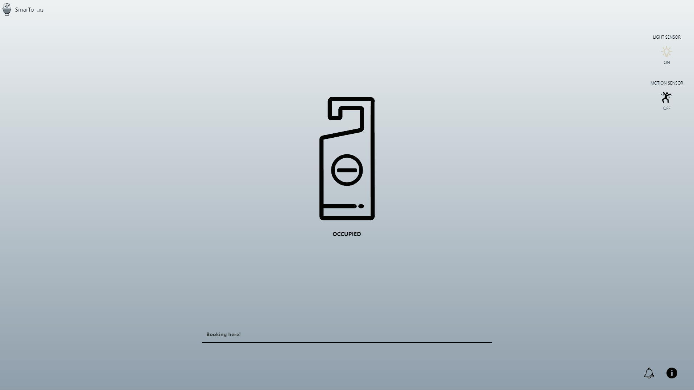

# SmarTo  

*SmarTo* is a web application built to make your office life *easier*. With *SmarTo* you can check the toilet availability from the comfort of your PC/SmartPhone.



We installed it in a bathroom with no windows, so the light sensor makes the bulk of the work. The motion sensor comes in handy when someone forgets to turn off the light. 
In fact, if the light has been on but there have been no movements within the past 20 minutes, SmarTo will notify that the toilet may be available.


## What it is made of

### Hardware

- Single-board computer (es: Raspberry Pi/OrangePi)
- Battery pack (optional)
- Photosensitive resistance sensor module
- HC-SR501 Pir Motion Detector - [Doc](https://www.mpja.com/download/31227sc.pdf)
- Jumper Wires x 6

#### Installation

Connect sensors on yours Single-board computer.

Example on Raspberry Model B+:

| Wires color | Description |
| --- | --- |
| Grey | 5v |
| White | Ground |
| Black | Signal |


After that you need to set the selected GPIO in the _server.js_ file.

Example with _Raspberry Model B+_ and connections preview:

```javascript
// Set GPIO number
var motionSensor = new Gpio(4, 'in', 'both');
var lightSensor = new Gpio(17,'in', 'both');
```

Raspberry Pi GPIO schema:


### Software

- [Angular 6.X](https://angular.io/) 
- [Node.js 9.X](https://nodejs.org/en/) 
- [Express.js 4.X](http://expressjs.com)

#### Prerequisites

Make sure you have installed all of the following prerequisites on your machine.

- Node.js - [https://github.com/nodesource/distributions](https://github.com/nodesource/distributions)

#### Installation

To install SmarTo's dependencies you are going to use npm. In the application root folder run this in the command-line:

```bash
$ npm install
```

## Running SmarTo 

After the install process is over, you'll be able to run *SmarTo*:

```bash
$ npm run-script build-prod
```

*SmarTo* will be running on port 80, just open your browser and visit _http://raspberry-ip_.


## Working on

| Board | OS | Tested |
| --- | --- | --- |
| Raspberry Pi 3 Model B | Raspbian | YES |
| OrangePi Lite | Armbian | YES |


## Local development and tests

To include development dependencies in the installation procedure, run this command from the application root folder:

```bash
$ npm install
```

After the installation process is over, you'll be able to run *SmarTo* locally by adding the _NODE_ENV_ environment variable:
(Note: example below only works for UNIX systems)

```bash
$ NODE_ENV=development node server.js
```

*SmarTo* will be running locally on the port specified in the _server.js_ file.

While running locally, the sensor value reads will be mocked since the GPIO library is compiled only for ARM architectures. You can change the value returned from the read function of the mocked sensors by editing the value in these lines of code in the _server/sensors.js_ file:

```javascript
const Gpio = process.env.NODE_ENV === 'development' ? 
  function Gpio() {
    this.read = (cb) => cb(null, 0); // <--- your value here (0 or 1)
    this.unexport = () => {};
  } :
  require('onoff').Gpio;
  ```

To run tests for the server part of the application, run this command: 

```bash
$ npm run test-server
```

To run tests and generate the coverage for the server part application, run this command:

```bash
$ npm run coverage-server
```

The coverage files will be generated in the _coverage/_ folder, in the root folder of the project.

## Something you have to know

- This is a little project built and develop in a week, in my free time after work. Many features are missing and the sensors can still be changed.
- If you like this project, help is always welcome.
- For any suggestion, open an issue.

## ToDo

- [X] Toilet reservation
- [X] Rewrite the backend with the newer version of node.js
- [X] Rewrite front-end with modern technologies + test
- [ ] Collect and show statistical data (es: peak hours)
- [ ] Android App

## Thanks

I would say thanks to:
- [FMeneguzzo](https://github.com/FMeneguzzo) for his help in updating and testing the backend.

## Credits

Icon made by [Freepik](http://www.flaticon.com/authors/freepik),  from [www.flaticon.com](www.flaticon.com )

## License

SmarTo's source code is released under [GNU AGPLv3 License](http://www.gnu.org/licenses/agpl-3.0.html).

> SmarTo
>
> Copyright (C) 2018 Mattia Favaron
>
> This program is free software: you can redistribute it and/or modify
> it under the terms of the GNU Affero General Public License as
> published by the Free Software Foundation, either version 3 of the
> License, or (at your option) any later version.
>
> This program is distributed in the hope that it will be useful,
> but WITHOUT ANY WARRANTY; without even the implied warranty of
> MERCHANTABILITY or FITNESS FOR A PARTICULAR PURPOSE. See the
> GNU Affero General Public License for more details.
>
> You should have received a copy of the GNU Affero General Public License
> along with this program. If not, see http://www.gnu.org/licenses/.